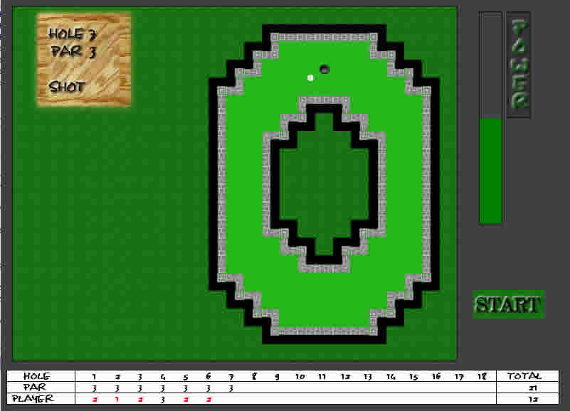



## Mini Golf 1\.0

### Description

Mini Golf 1.0 is a complete 18 hole mini golf game , all the the graphics I made there nothing special but they serve the purpose this is my first installment of 2 versions . This one uses bitblt , I hope to update to directx in the next version and add some sounds . if there is any problems please leave a comment. Thankyou
 
### More Info
 

             |
---                |---
**Submitted On**   |2004-01-30 09:06:24
**By**             |[Hagen](https://github.com/Planet-Source-Code/PSCIndex/blob/master/ByAuthor/hagen.md)
**Level**          |Intermediate
**User Rating**    |5.0 (25 globes from 5 users)
**Compatibility**  |VB 3\.0, VB 4\.0 \(16\-bit\), VB 4\.0 \(32\-bit\), VB 5\.0, VB 6\.0
**Category**       |[Games](https://github.com/Planet-Source-Code/PSCIndex/blob/master/ByCategory/games__1-38.md)
**World**          |[Visual Basic](https://github.com/Planet-Source-Code/PSCIndex/blob/master/ByWorld/visual-basic.md)
**Archive File**   |[Mini\_Golf\_1701801302004\.zip](https://github.com/Planet-Source-Code/hagen-mini-golf-1-0__1-51367/archive/master.zip)

